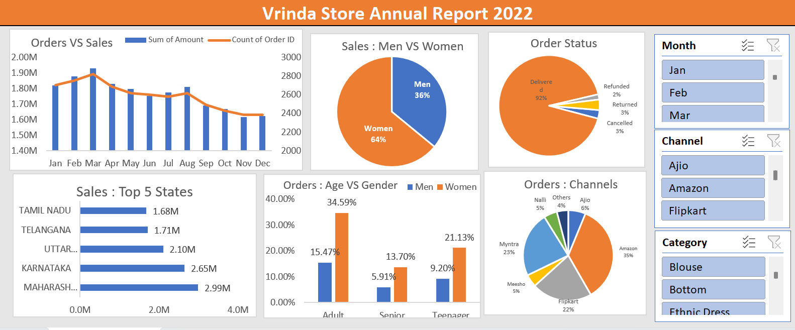

# 📊 Vrinda Store Sales Analysis – Excel Dashboard Project

## 📷 Dashboard Preview

---

## 📌 Project Overview
This project focuses on analyzing retail sales data using Microsoft Excel.  
The dataset contained over 31,000 rows of raw data which required cleaning, transformation, and structured analysis.

The objective was to build an interactive dashboard that helps identify sales trends, customer behavior, and business performance insights.

---

## 🧹 Data Cleaning & Preparation
- Standardized inconsistent gender values (m, men, w, women → Men/Women)
- Corrected date formats
- Created Month column from date
- Added calculated columns using IF formula
- Fixed formatting issues
- Cleaned and structured 31,000+ rows of data

---

## 📊 Analysis Performed
- Sales by category
- Revenue by gender
- Monthly sales trends
- Top performing products
- Regional performance comparison

---

## 📈 Dashboard Features
- Interactive slicers
- Pivot tables & pivot charts
- Dynamic filtering
- Clean dashboard layout

---

## 🛠 Tools Used
- Microsoft Excel
- Pivot Tables
- Charts
- Slicers
- IF Formula
- Data Cleaning Techniques

---

## 📊 Key Business Insights

- Female customers contribute approximately 65% of total purchases, significantly higher than male customers.

- Maharashtra, Karnataka, and Uttar Pradesh are the top three revenue-generating states, contributing around 35% of overall sales.

- The 30–49 years age group is the highest contributing segment, accounting for nearly 50% of total revenue.

- Amazon, Flipkart, and Myntra are the dominant sales channels, contributing approximately 80% of total orders.

---

## 🎯 Business Recommendation

To improve Vrinda Store sales:

- Focus marketing campaigns on women aged 30–49 years.
- Target high-performing states such as Maharashtra, Karnataka, and Uttar Pradesh.
- Increase promotions, advertisements, and discount offers on major platforms like Amazon, Flipkart, and Myntra to maximize revenue growth.

---

## 👩‍💻 Author
Kashish Rawat  
Aspiring Data Analyst  
Excel | SQL | Power BI
